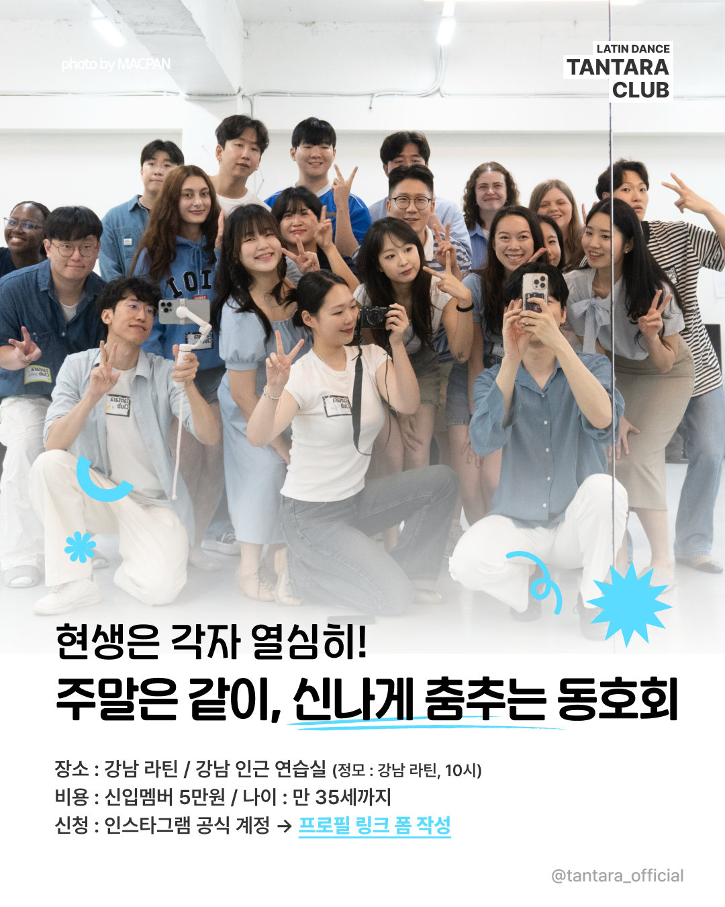
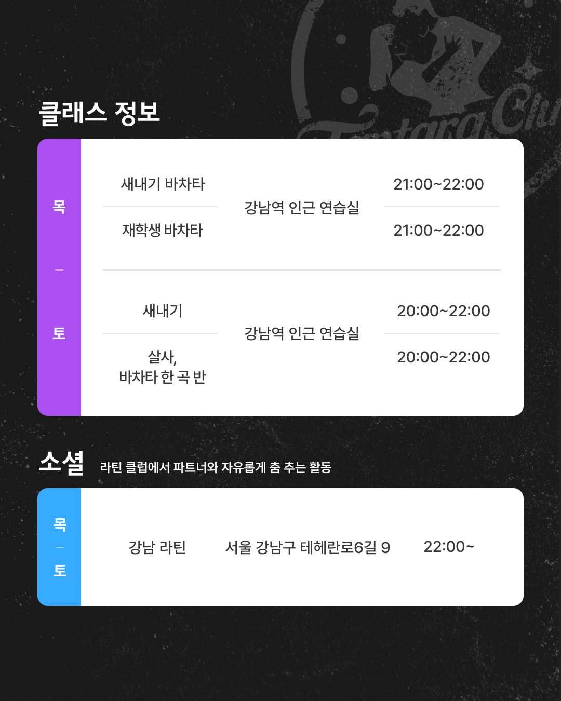
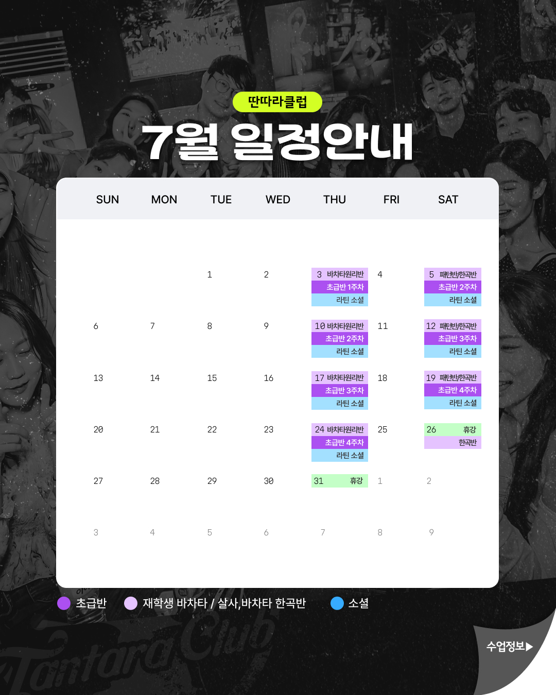
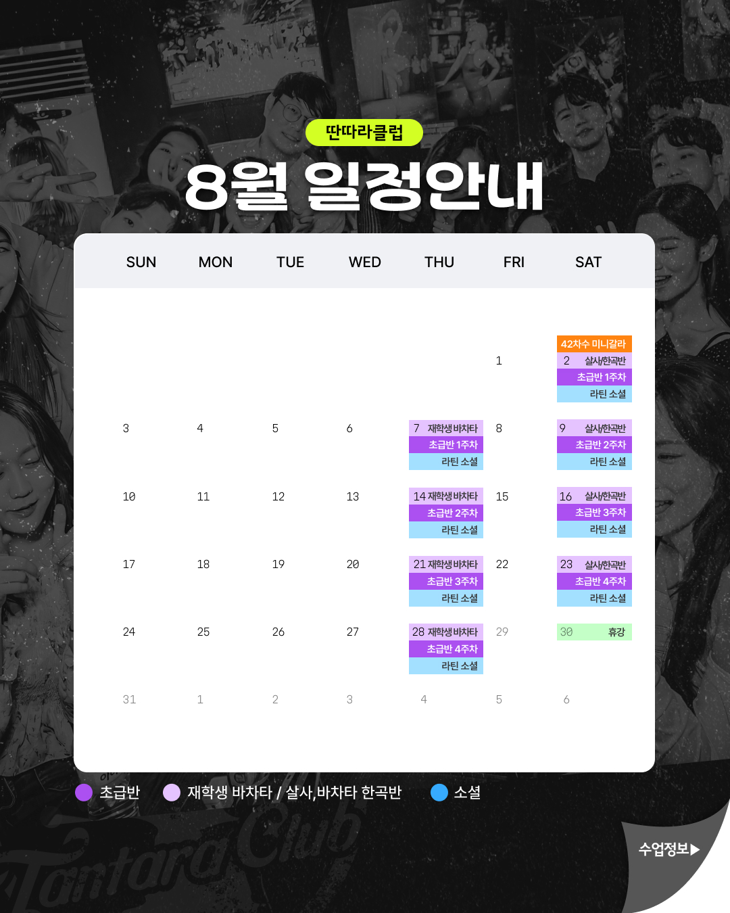

# 슬기로운 딴따라 생활

    

        
    

    

        
    

    

        
    

    

        
    

### 딴따라클럽 인스타그램 (활동 영상)  
Tantara Club Instagram  
https://www.instagram.com/tantara_official?igsh=MWR4Z3A4cDZrbGd0dQ== 

## 딴따라클럽 소모임 (매주 정모 정보, 활동 사진, 자기소개)  
Tantara Club Somoim (Every week gathering information)  
https://somoim.friendscube.com/g/4815f134-20c6-11ee-91fe-0a372a1b7bbd1 

## 딴따라클럽 당근마켓 (활동 사진)  
Tantara Club Daangn  
https://www.daangn.com/kr/groups/QdyRNR0j

## 딴무위키 소셜매너(새내기 필독)  
Ddanmuwiki Social Manner (Newcomer must read)  
https://tantaraclub.pythonanywhere.com/w/%EC%86%8C%EC%85%9C%EB%A7%A4%EB%84%88

## 수업장소 안내

### 토요일

✅새내기 클래스: 8시 ⭐ 강남 세아빌딩 3층 작은 홀  
✅재학생: 8시 ⭐ 강남 세아빌딩 3층 큰 홀  
✅수업 장소 주소 : 서울 강남구 강남대로94길 55 (역삼동 636-22 세아빌딩 3층)  

http://map.daum.net/link/map/

- 1교시 (8시00분 ~ 8시50분)
- 2교시 (8시55분 ~ 9시45분)
- 행사 및 공지 시간 (9시45분~10시)
- 연습 및 소셜댄스 : 강남 라틴 10시~ (주소: 테헤란로 6길 9)

### 목요일

✅ 목요일 강남 9-10시 (주소: 추후 공지)에 강습이 진행됩니다.

불편하지 않은 옷과 신발차림으로 와주시면 됩니다.
(밑창이 뻑뻑해서 너무 안미끄러지는 신발은 피해주세요!, 마실 음료도 있으면 좋습니다)

---

**Saturday Class Location and Schedule**

✅ **Freshman Class**: 8:00 PM ⭐ Gangnam Sea Building 3rd Floor Small Hall  
✅ **Continuing Students**: 8:00 PM ⭐ Gangnam Sea Building 3rd Floor Large Hall  
✅ **Class Address**: 55 Gangnam-daero 94-gil, Gangnam-gu, Seoul (Yeoksam-dong 636-22 Sea Building 3rd Floor)

http://map.daum.net/link/map/

**Schedule**:
- 1st Period (8:00 PM ~ 8:50 PM)  
- 2nd Period (8:55 PM ~ 9:45 PM)  
- Events & Announcements (9:45 PM ~ 10:00 PM)  
- Practice & Social Dance: Gangnam Latin 10:00 PM~ (Address: 9 Teheran-ro 6-gil)  

**Thursday classes** run 9-10 PM in Gangnam (address to be announced later).  

Please wear comfortable clothes and shoes.
(Avoid shoes with very stiff soles that don't slide at all! It's also good to bring something to drink.)

---

## 홍보문구

### SNS 홍보문구

🌟 **sns 홍보 문구 및 인증 방법 안내**

-   에타 연합동아리 게시판(메인 포스터 + 43기 모집글)
-   동아리 게시판, 블라인드 등 (모집글, QR 포스터 등 자유롭게)
-   카페, 블라인드, 인스타스토리 등 플랫폼
-   지인 카톡방 (본인 제외 4명이상 카톡방)  
    동아리 홍보글 작성 후 10분 이상 카톡 유지

### 에타 홍보문구
#### 홍보인증: https://forms.gle/nBFQ79TvKXrbXyAk8

**제목**: 라틴댄스동아리💃딴따라클럽🕺 신규회원 모집!

**내용**:
✒1분만에 지원하기! 딴따라클럽 새내기 지원 폼
https://zrr.kr/Jyd73N

*명칭안내 : 새내기(신입회원), 재학생(가입 후 활동 유지 회원)

🌟 **모집 안내** 🌟
- 모집 기간 : 상시모집(차수별)
- 수업료 : 6만원 (라틴댄스 2과목 4주과정)
- ✔ 친구와 동반 등록하는 경우 1만원에서 최대 4만원까지 할인!
- ✔ 20-35살이라면 누구나!
- ✔ 커플 댄스 춤을 배워보고 싶은 분들!

🌟 **새내기 활동 안내** 🌟
- 활동 지역 : 강남 (지하철역 인근)
- 활동 일정
  - ✔ 매주 토요일 수업 (오후 8시-10시) 강남
  - ✔ 매주 목요일 수업 (오후 9시-10시) 강남
  - ✔ 매주 토, 목요일 정모 (오후 10시-∞)

※ 수업 후 뒤풀이&소셜댄스가 있으며 모든 활동은 강제 참여가 아닌 자율로 이루어집니다!

🌟 **활동 관련 문의** 🌟
💬 딴따라클럽 새내기 문의방  
https://bit.ly/TantaraNewbie
